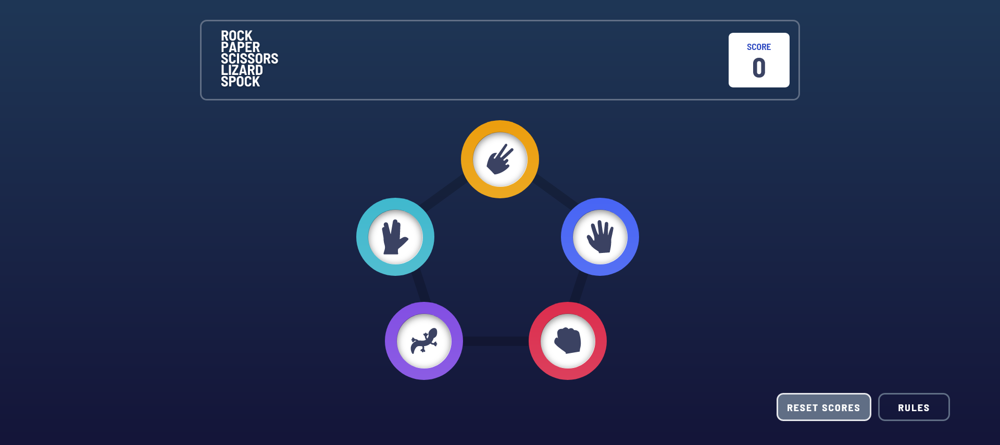
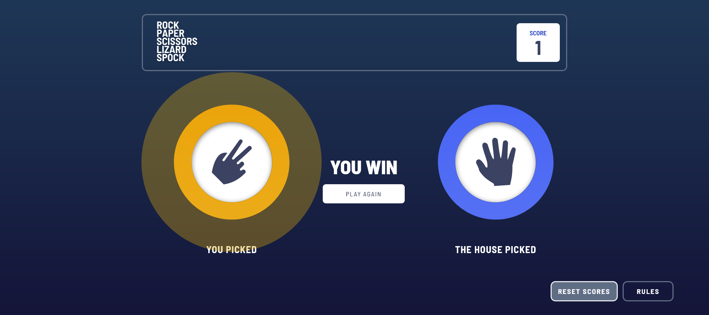
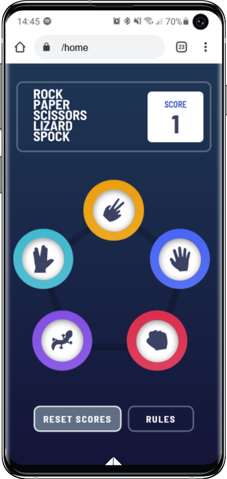
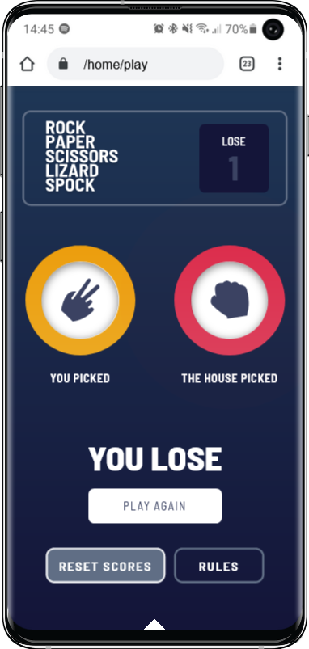

# Frontend Mentor - Rock, Paper, Scissors solution

This is a solution to the [Rock, Paper, Scissors challenge on Frontend Mentor](https://www.frontendmentor.io/challenges/rock-paper-scissors-game-pTgwgvgH). Frontend Mentor challenges help you improve your coding skills by building realistic projects.

## Table of contents

- [Overview](#overview)
  - [The challenge](#the-challenge)
  - [Screenshot](#screenshot)
  - [Links](#links)
- [My process](#my-process)
  - [Built with](#built-with)
- [Author](#author)

**Note: Delete this note and update the table of contents based on what sections you keep.**

## Overview

### The challenge

Users should be able to:

- View the optimal layout for the game depending on their device's screen size
- Play Rock, Paper, Scissors against the computer
- Maintain the state of the score after refreshing the browser _(optional)_
- **Bonus**: Play Rock, Paper, Scissors, Lizard, Spock against the computer _(optional)_

### Screenshot

### Links

- Solution URL: [Project Solution](https://github.com/Stephen-Adom/rock-paper-scissor-lizard-spock-game)
- Live Site URL: [App Live View](https://rock-paper-scissor-lizard-spock-game-seven.vercel.app/)

## My process

### Built with

- Semantic HTML5 markup
- CSS custom properties
- Flexbox
- CSS Grid
- Mobile-first workflow
- Typescript
- [React](https://reactjs.org/) - JS library
- [Tailwind](https://tailwindcss.com/) - React CSS Styles and Responsives
- [PrimeReact](https://www.primefaces.org/primereact/) - For UI Component

## Author

- Frontend Mentor - [@Stephen-Adom](https://www.frontendmentor.io/profile/Stephen-Adom)
- Twitter - [@Alaska67524884](https://twitter.com/Alaska67524884)
- LinkedIn - [Stephen Addae](https://www.linkedin.com/in/stephen-addae-a32334154/)
